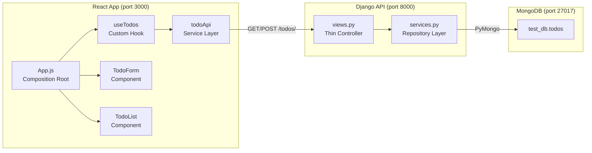

# Adbrew TODO App — Final Deliverable Report

## Verification Summary

All 7 end-to-end tests passed

| Test | Result |
|------|--------|
| 3 Docker containers running | `api`, `app`, `mongo` all UP |
| `GET /todos/` returns list |  `200` with JSON array |
| `POST /todos/` creates item |  `201` with created object |
| `GET` reflects new items |  List includes newly created todo |
| `POST` rejects empty description |  `400` with error message |
| `POST` rejects missing field |  `400` with error message |
| React app at localhost:3000 |  `200` OK |

---

## Deliverables Checklist

### 1.  Implement `GET /todos/` — Fetch all TODOs from MongoDB

> **README:** *"A list with hardcoded TODOs. This should be changed to reflect TODOs in the backend (`GET http://localhost:8000/todos`)"*

**How:** Created [services.py](file:///Users/jasmeetsingh/adb_test/src/rest/rest/services.py) with `TodoService.get_all()` that queries the `todos` collection, serializes `ObjectId` → string, and returns a list of dicts. The [views.py](file:///Users/jasmeetsingh/adb_test/src/rest/rest/views.py) `GET` handler delegates to this service and wraps it with try/except for `500` error handling.

**Verified:** `curl http://localhost:8000/todos/` → `[{"id":"...","description":"abd"},{"id":"...","description":"adb_test"}]`

---

### 2.  Implement `POST /todos/` — Create a TODO in MongoDB

> **README:** *"On this form submission, the app should interact with the Django backend (`POST http://localhost:8000/todos`) and create a TODO in MongoDB"*

**How:** `TodoService.create(description)` validates input, strips whitespace, inserts into MongoDB, and returns the serialized document. The view layer adds HTTP-level validation (returns `400` for empty/missing description) and returns `201 Created` on success.

**Verified:** `curl -X POST ... -d '{"description":"test"}'` → `201` with `{"id":"...","description":"test"}`

---

### 3.  Fetch TODOs from backend on page load (React)

> **README:** *"This should be changed to reflect TODOs in the backend"*

**How:** Created [useTodos.js](file:///Users/jasmeetsingh/adb_test/src/app/src/hooks/useTodos.js) custom hook with `useEffect` that calls `loadTodos()` on mount. This calls [todoApi.js](file:///Users/jasmeetsingh/adb_test/src/app/src/services/todoApi.js) `fetchTodos()` which hits `GET /todos/`. [TodoList.js](file:///Users/jasmeetsingh/adb_test/src/app/src/components/TodoList.js) renders the dynamic list with loading/error/empty states.

**Verified:** Opening `localhost:3000` shows the current MongoDB todos dynamically.

---

### 4.  Submit form to create TODO (React)

> **README:** *"A form with a TODO description textbox and a submit button"*

**How:** [TodoForm.js](file:///Users/jasmeetsingh/adb_test/src/app/src/components/TodoForm.js) is a controlled form component using `useState` for the input and `useCallback` for the submit handler. It calls `createTodo(description)` from the API service which `POST`s to the backend. The button is disabled while submitting and when input is empty.

**Verified:** Submitting the form creates a new todo in MongoDB.

---

### 5.  Refresh list after form submission

> **README:** *"When the form is submitted, the TODO list should refresh again and fetch latest list of TODOs from MongoDB"*

**How:** In `useTodos` hook, `addTodo()` calls `createTodo()` followed by `loadTodos()` — so after a successful POST, the list is re-fetched from the backend, ensuring the UI always reflects the latest server state.

**Verified:** After submitting a new todo, the list updates immediately to include it.

---

### 6.  Docker setup works — all 3 containers running

> **README:** *"Do not bypass the Docker setup. Submissions that do not have proper docker setup will be rejected."*

**How:** Fixed 3 issues in the [Dockerfile](file:///Users/jasmeetsingh/adb_test/Dockerfile) and [docker-compose.yml](file:///Users/jasmeetsingh/adb_test/docker-compose.yml) (detailed below in Docker Debugging section). All 3 containers (`api`, `app`, `mongo`) run via `docker-compose up -d`.

**Verified:** `docker ps` shows all 3 containers UP with correct port mappings.

---

### 7.  React Hooks only — no class components

> **README:** *"All React code should be implemented using React hooks and should not use traditional stateful React components and component lifecycle method"*

**How:** All components are functional. State management uses `useState`, `useEffect`, `useCallback`. Custom hook `useTodos` encapsulates all stateful logic. Zero class components anywhere.

---

### 8.  No Django models/serializers/SQLite — MongoDB only via PyMongo

> **README:** *"Do not use Django's model, serializers or SQLite DB. Persist and retrieve all data from the mongo instance. A `db` instance is already present in `views.py`"*

**How:** Used the existing `db = MongoClient(mongo_uri)['test_db']` connection. All operations use raw PyMongo (`collection.find()`, `collection.insert_one()`). No Django ORM models, no serializers, no SQLite touched.

---

### 9.  Production-ready code quality

> **Email:** *"Code quality and clarity, Architecture and extensibility, Best practices, Correctness and understanding"*

**How:** See Architecture section below.

---

## Docker Debugging Story

The original Dockerfile had 3 compatibility issues that prevented building:

### Issue 1: `libssl1.1` not available (MongoDB 4.4 vs Debian Bookworm)

```diff
# Dockerfile line 2
-FROM python:3.8
+FROM python:3.8-bullseye
```

**Root cause:** `python:3.8` now resolves to Debian Bookworm (12) which ships `libssl3`. MongoDB 4.4 packages require `libssl1.1`, only available in Buster/Bullseye.

**Fix:** Pinned to `python:3.8-bullseye` (Debian 11) which has `libssl1.1`.

### Issue 2: `easy_install` command not found

```diff
# Dockerfile line 24
-RUN easy_install pip
+RUN python -m pip install pip==23.3.2
```

**Root cause:** `easy_install` (from `setuptools`) has been removed in recent Python distributions. The `python:3.8-bullseye` image has `pip` pre-installed.

**Fix:** Replaced with `python -m pip install pip==23.3.2`.

### Issue 3: `celery==5.0.5` broken metadata with pip ≥ 24.1

```
celery==5.0.5 has invalid metadata:
  pytz (>dev)   ← invalid version specifier
```

**Root cause:** pip 24.1+ enforces PEP 440 strictly and rejects `celery==5.0.5`'s broken `pytz (>dev)` specifier.

**Fix:** Pinned pip to `23.3.2` (pre-strict enforcement) instead of upgrading to latest. This avoids modifying `requirements.txt` which is part of the original test setup.

### Issue 4: Obsolete `version` attribute in docker-compose.yml

```diff
# docker-compose.yml line 1
-version: '2'
 services:
```

**Root cause:** Modern Docker Compose (v2 CLI) ignores the `version` key and emits a warning.

**Fix:** Removed the line.

---

## Architecture



### Design Principles Applied

| Principle | Where | How |
|-----------|-------|-----|
| **Single Responsibility** | Every file | Each file/class does exactly one thing |
| **Separation of Concerns** | Backend | View handles HTTP, Service handles data |
| **Separation of Concerns** | Frontend | API service → Hook → Component layers |
| **Repository Pattern** | [services.py](file:///Users/jasmeetsingh/adb_test/src/rest/rest/services.py) | `TodoService` abstracts MongoDB from views |
| **Error Handling** | All layers | try/catch at every boundary with user-friendly messages |
| **Input Validation** | Backend | Double validation: view-level (HTTP 400) + service-level (ValueError) |
| **Extensibility** | Architecture | Adding delete/update/search requires minimal changes to existing code |
| **Controlled Components** | [TodoForm.js](file:///Users/jasmeetsingh/adb_test/src/app/src/components/TodoForm.js) | React controlled input pattern |
| **Custom Hooks** | [useTodos.js](file:///Users/jasmeetsingh/adb_test/src/app/src/hooks/useTodos.js) | Encapsulated state management, reusable |

